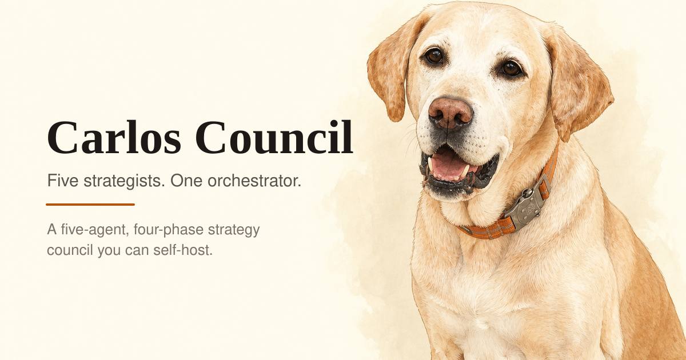
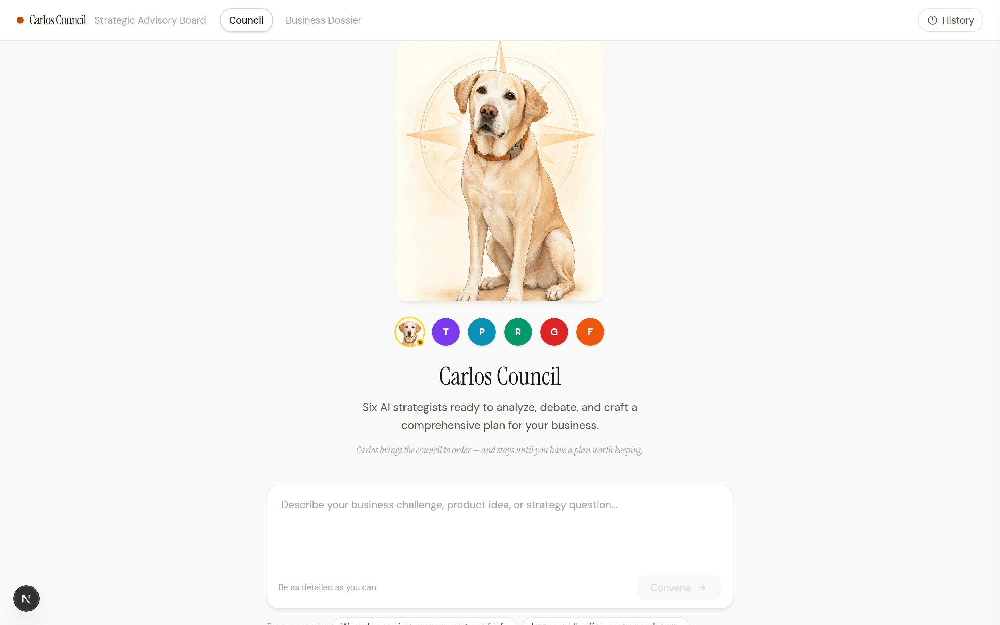
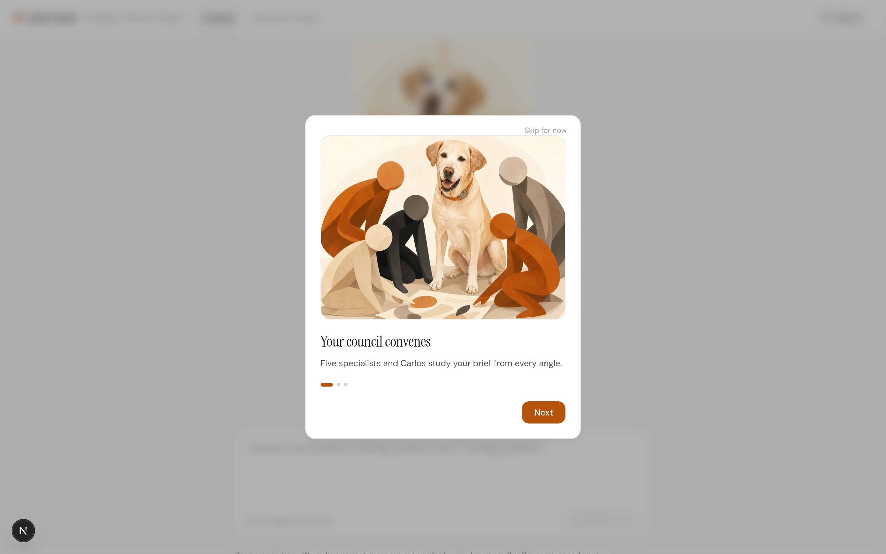

<div align="center">
  

  # Carlos Council

  **Five AI strategists. One orchestrator. Better decisions through disagreement.**
  Submit a business brief and watch five AI strategists — guided by Carlos, the council
  orchestrator — analyze, challenge, and synthesize a plan in real time.

  <sub>FastAPI · Next.js · Server-Sent Events · works with any OpenAI-compatible model</sub>
</div>

---

## Preview





---

## Why Carlos Council exists

Most AI tools give you **one** answer in one voice. Real strategy doesn't work that way —
good plans survive disagreement. Carlos Council forces five expert perspectives to collide —
a storyteller, a product architect, a revenue strategist, a growth hunter, and an operator —
while **Carlos** orchestrates the council: he holds the room, routes the voices, challenges
weak thinking, and turns the debate into a clear strategy.

> ### The story of Carlos
> Carlos Council is named after a dog. Carlos was the one you could trust with almost
> anything — calm under pressure, good with everyone, the steady presence a whole pack
> organized itself around. This project borrows that spirit: a wise, grounded companion who
> brings a noisy room to order and helps you leave with something worth keeping. Carlos
> isn't a gimmick here — he's the tone we're aiming for.

## What it does

You submit a business brief. Five specialists go to work; Carlos orchestrates them through
four phases:

**Phase 1 — Initial Analysis.** Five specialists analyze your brief simultaneously:

| Agent | Focus |
|-------|-------|
| **The Storyteller** | Brand positioning, narrative, emotional resonance |
| **Product Architect** | Product-market fit, UX, feature strategy |
| **Revenue Strategist** | Monetization, pricing, unit economics |
| **Growth Hunter** | Acquisition channels, virality, market entry |
| **Field Operator** | Operations, timelines, resources, risk |

**Phase 2 — Synthesis & Clarification.** Carlos synthesizes all five analyses, identifies
contradictions, and asks you 2–3 sharp clarification questions.

**Phase 3 — Debate.** Carlos moderates two rounds of focused debate. Weak ideas get
exposed; strong ones get sharper.

**Phase 4 — Final Plan.** Carlos delivers a definitive 10-point strategic plan.

Everything **streams in real time** — you watch the agents think, argue, and converge.

## Features

- 🧠 **Five specialist perspectives** orchestrated by Carlos — not one flattened opinion
- 🎭 **Structured 4-phase debate** with Carlos as orchestrator, surfacing real tensions
- ⚡ **Live streaming** via Server-Sent Events, with an automatic polling fallback
- 🗂️ **Business Dossier** — a persistent company profile injected into every session
- 🕘 **Session history & replay** — revisit and re-read past councils
- 🧩 **Cross-session memory** — lessons from past sessions inform future ones
- 🔌 **Any OpenAI-compatible model** — OpenAI, OpenRouter, Ollama, vLLM, …
- 🔒 **No API keys in the browser** — the frontend proxies to the backend, which holds the key

## Tech stack

| Layer | Tech |
|-------|------|
| Backend | Python 3.12, FastAPI, OpenAI SDK, aiosqlite, sse-starlette |
| Frontend | Next.js 16, React 19, TypeScript, Tailwind CSS v4, Zustand |
| Database | SQLite |
| Deployment | Docker Compose (Railway config included for the backend) |

## Prerequisites

- **Docker + Docker Compose** (recommended path), **or**
- **Python 3.11+** and **Node.js 20+** for local development
- An **API key** for any OpenAI-compatible provider

## Quick start (Docker)

```bash
git clone https://github.com/TalYahav-dev/carlos-council.git
cd carlos-council

cp .env.example .env
# Edit .env — add your OPENAI_API_KEY (and base URL / model if not OpenAI)

docker compose up -d --build
```

Open **http://localhost:3006**. It's also reachable from other devices on your LAN at
`http://<your-ip>:3006`.

The backend fails fast with a clear message if `OPENAI_API_KEY` is missing.

## Quick start (local development)

**Backend:**

```bash
cd backend
python3 -m venv .venv
source .venv/bin/activate
pip install -r requirements.txt

cp ../.env.example ../.env   # then edit ../.env with your key
uvicorn main:app --reload --host 0.0.0.0 --port 8000
```

**Frontend** (in a second terminal):

```bash
cd frontend
npm install
# point the proxy at your local backend:
echo "COUNCIL_BACKEND_URL=http://127.0.0.1:8000" > .env.local
npm run dev
```

Open **http://localhost:3000**.

### Optional: seed a Business Dossier

A sanitized example profile is in [`examples/business-dossier.example.md`](examples/business-dossier.example.md):

```bash
cd backend
python scripts/import_business_dossier.py ../examples/business-dossier.example.md
```

## Environment variables

| Variable | Default | Description |
|----------|---------|-------------|
| `OPENAI_API_KEY` | — | **Required.** Provider API key (backend only) |
| `OPENAI_BASE_URL` | `https://api.openai.com/v1` | Provider base URL |
| `MODEL_NAME` | `gpt-4o` | Model used for all agents |
| `DB_PATH` | `backend/data/council.db` | SQLite file path |
| `ALLOWED_ORIGINS` | localhost dev origins | Comma-separated CORS allow-list |
| `LLM_TIMEOUT` | `120` | Per-request LLM timeout (seconds) |
| `LLM_MAX_RETRIES` | `2` | LLM retry count |
| `COUNCIL_BACKEND_URL` | `http://127.0.0.1:8000` | Frontend → backend proxy target |
| `NEXT_PUBLIC_SPLINE_SCENE_URL` | _(empty)_ | Optional 3D hero scene URL |

**Provider examples:**

```bash
# OpenAI
OPENAI_API_KEY=sk-...           ; OPENAI_BASE_URL=https://api.openai.com/v1 ; MODEL_NAME=gpt-4o
# OpenRouter
OPENAI_API_KEY=sk-or-...        ; OPENAI_BASE_URL=https://openrouter.ai/api/v1 ; MODEL_NAME=anthropic/claude-sonnet-4
# Ollama (local, no key needed)
OPENAI_API_KEY=not-needed       ; OPENAI_BASE_URL=http://localhost:11434/v1 ; MODEL_NAME=llama3.1:70b
```

## Development commands

```bash
# Frontend
cd frontend && npm run dev      # dev server
cd frontend && npm run lint     # eslint
cd frontend && npm run build    # production build

# Backend
cd backend && uvicorn main:app --reload   # dev server
```

## Testing

The backend has a test suite under `backend/tests/` (26 tests) covering request-model
validation, business-dossier parsing, the orchestrator's four-phase flow and error path,
and the HTTP endpoints. The LLM is mocked, so the tests need no API key and make no network
calls.

```bash
cd backend
pip install pytest pytest-asyncio httpx   # or: pip install -e ".[dev]"
pytest
```

The frontend has no automated tests yet — contributions are very welcome. For a full
manual check, start the stack and run a council end-to-end.

## API

| Method | Endpoint | Description |
|--------|----------|-------------|
| `GET` | `/health` | Health check |
| `POST` | `/api/council/start` | Start a session (`{"brief": "..."}`) |
| `GET` | `/api/council/{id}/stream` | SSE event stream |
| `POST` | `/api/council/{id}/clarify` | Submit clarification answers |
| `GET` | `/api/council/{id}/status` · `/snapshot` | Status / full state |
| `GET` | `/api/sessions` · `/api/sessions/{id}` | List / fetch sessions |
| `GET`/`PUT` | `/api/profile` | Read / update the Business Dossier |

## Deployment notes

- The backend ships with a `railway.toml` (Dockerfile build, `/health` healthcheck).
- The frontend is a standard Next.js app (deployable to Vercel or any Node host); set
  `COUNCIL_BACKEND_URL` to your backend's address.
- **Before exposing this to the public internet, read the security notes below.**

## Security notes

Carlos Council is designed for **local or trusted-network, single-user** use. It has
**no authentication** — anyone who can reach the backend can start sessions and read all
transcripts. If you deploy it publicly, put it behind an authenticating reverse proxy and
restrict `ALLOWED_ORIGINS`. The LLM API key lives only on the backend and is never sent to
the browser. See [`SECURITY.md`](SECURITY.md) and [`docs/SECURITY_AUDIT.md`](docs/SECURITY_AUDIT.md).

## Contributing

Contributions are welcome — see [`CONTRIBUTING.md`](CONTRIBUTING.md). Good first issues:
tests, accessibility improvements, onboarding polish, and Carlos visual assets.

## Roadmap

- [x] Automated tests (backend orchestration + API) — frontend tests still welcome
- [ ] Optional authentication for shared/hosted deployments
- [ ] Session export (Markdown / PDF)
- [ ] Per-session model overrides
- [ ] Dark mode

## License

[MIT](LICENSE)

## Credits

Built by Tal as a first open-source product, and named after Carlos — a very good dog.
